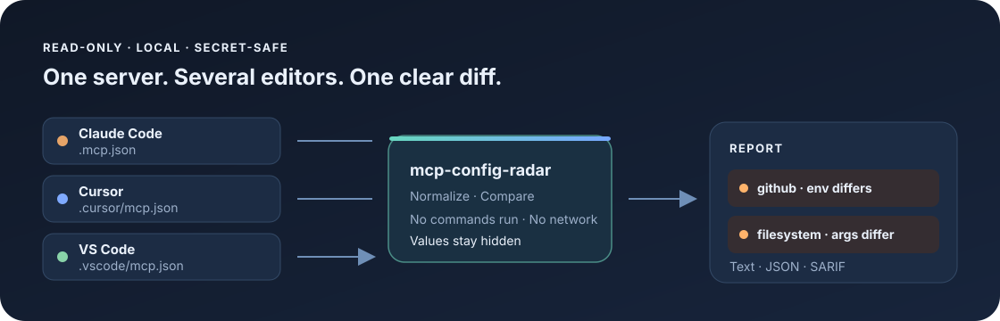

# MCP Config Radar

[English](README.md) · [简体中文](README.zh-CN.md)

**在不同 AI 编程工具之间比较 MCP 服务器配置，用不泄露敏感值的差异报告接入 CI。**


同一个 MCP 服务器可能同时配置在 Claude Code、Cursor、VS Code 或 Gemini CLI 中。参数或环境变量稍有不同，就可能导致它在一个工具里能用、在另一个工具里失败。MCP Config Radar 会在本机比较这些配置，并生成适合 CI 使用的报告；敏感配置值不会被写入报告。



## 快速开始

需要 Python 3.11 或更高版本。

```bash
python -m pip install .
mcp-config-radar .
```

也可以从仓库安装：

```bash
git clone https://github.com/bluetn514/mcp-config-radar.git
cd mcp-config-radar
python -m pip install .
```

不安装命令入口时，也可以直接运行：

```bash
python -m mcp_config_radar .
```

示例输出：

```text
mcp-config-radar 0.1.0

Scanned 3 config(s) and 3 server definition(s).
  claude-code      .mcp.json (1 server(s))
  cursor           .cursor/mcp.json (1 server(s))
  vscode           .vscode/mcp.json (1 server(s))

CONFIGURATION DRIFT
  DRIFT    server 'github' differs between .mcp.json and .cursor/mcp.json; fields: env
  DRIFT    server 'github' differs between .mcp.json and .vscode/mcp.json; fields: args, env
  Values for command args, environment variables, and HTTP headers are never printed.

Summary: 2 drift, 0 missing expected server(s), 0 config error(s).
```

可以先试试仓库自带的示例：

```bash
mcp-config-radar examples/project
```

## 检查内容

- 在受支持的配置文件中查找同名 MCP 服务器，比较传输方式、命令、参数、工作目录、URL、启用状态、环境变量和 HTTP 请求头。
- 使用 `--expect` 指定需要包含服务器配置的客户端，检查是否有客户端缺失配置。
- 检查无效 JSON/TOML、重复 JSON 键和格式错误的服务器配置表。
- 输出可读文本、JSON 或 SARIF，方便本地查看或接入代码扫描流程。
- 发现配置差异时返回 `1`；配置无法读取或格式无效时返回 `2`，可用于 CI。

## 支持的配置位置

项目扫描会查找项目目录下的配置文件，并跳过 `.git`、`node_modules`、`.venv`、`vendor` 和 `dist` 等目录。

| 客户端 | 项目配置 | `--user` 用户配置 |
| --- | --- | --- |
| Claude Code | `.mcp.json` | `~/.claude.json` |
| Cursor | `.cursor/mcp.json` | `~/.cursor/mcp.json` |
| VS Code | `.vscode/mcp.json` | — |
| Gemini CLI | `.gemini/settings.json` | `~/.gemini/settings.json` |
| Codex | — | `~/.codex/config.toml` |
| Claude Desktop | — | 按操作系统确定的 `claude_desktop_config.json` |
| Windsurf | — | `~/.codeium/windsurf/mcp_config.json` |

只有指定 `--user` 时才会读取用户级配置。其他路径可通过 `--config PATH` 显式添加。

## 常用示例

### 加入用户级配置

```bash
mcp-config-radar . --user
```

### 指定必须配置该服务器的客户端

```bash
mcp-config-radar . --expect cursor,vscode,codex
```

此检查默认不启用，因为不同项目使用的编辑器并不相同。

### 输出 JSON 报告

```bash
mcp-config-radar . --format json > mcp-config-radar.json
```

### 输出 SARIF 报告

```bash
mcp-config-radar . --format sarif > mcp-config-radar.sarif
```

可以参考 [GitHub Actions 示例](examples/ci/mcp-config-radar.yml)，上传 SARIF 并在发现配置差异时让 CI 失败。

### 检查自定义路径

```bash
mcp-config-radar . --config ./config/team-mcp.json
```

## 隐私与安全

- 工具只读配置，不会改写文件、执行 MCP 服务器命令或连接远程 MCP 服务。
- 配置值保留在本机内存中进行比较。
- 报告不会包含命令参数、环境变量值、URL 凭证或 HTTP 请求头值；对这些字段只报告发生差异的字段名。
- 只有在明确需要扫描个人配置时才使用 `--user`。

## 项目范围

MCP Config Radar 比较不同客户端配置文件中同名服务器的条目。它不会启动进程、探测服务地址、测试凭证、测量服务器性能，也不会判断配置差异是否符合你的预期；它会指出差异字段，供你检查。

## 相近项目

本项目专注于跨客户端配置比较和不暴露配置值的差异报告，不负责诊断服务器健康或审计服务器行为。相关工具包括：[`mcp-doctor`](https://github.com/realwigu/mcp-doctor)，用于更广泛的服务器诊断、安全检查和性能测试；[`mcp-config-doctor`](https://github.com/aolingge/mcp-config-doctor)，用于检查单个配置文件和常见接入问题。 [`egao1980/mcp-parity`](https://github.com/egao1980/mcp-parity) 用于测试不同 SDK 之间的 MCP 协议互通，属于另一种 parity 检查。

## 参与贡献

欢迎提交问题和拉取请求。新增客户端适配时，请附上该客户端配置格式的官方文档链接和已脱敏示例。更多说明见 [CONTRIBUTING.md](CONTRIBUTING.md)。

## 许可证

MIT，详见 [LICENSE](LICENSE)。
